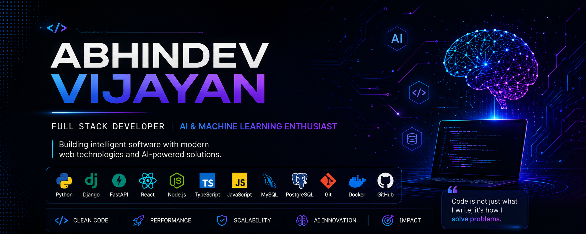

<p align="center">
  
</p>

<h1 align="center">Hi 👋, I'm Abhindev Vijayan</h1>

<h3 align="center">
Full Stack Developer • AI & Machine Learning Enthusiast • Backend Developer
</h3>

<p align="center">

</p>

<p align="center">
  <a href="https://github.com/AbhindevVijayan">
    
  </a>

  <a href="https://www.linkedin.com/in/abhindev-vijayan-516454245/">
    
  </a>

  <a href="https://abhindevvijayan-portfolio.vercel.app/">
    
  </a>

  <a href="mailto:abhindevvijayan18@gmail.com">
    
  </a>
</p>

---

## 👨‍💻 About Me

```yaml
Name: Abhindev Vijayan

Location: Kerala, India

Education:
  - Master of Computer Applications (MCA)

Focus:
  - Full Stack Development
  - Artificial Intelligence
  - Backend Engineering

Currently Learning:
  - AI Agents
  - Retrieval-Augmented Generation (RAG)
  - System Design

Interests:
  - Open Source
  - Machine Learning
  - Modern Web Technologies
```

---

> *"Building software that is clean, scalable, and driven by intelligent solutions."*
