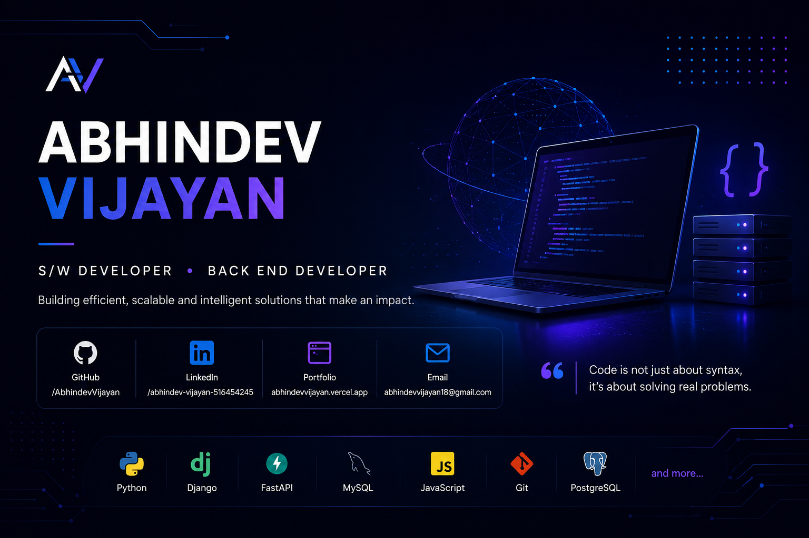

<p align="center">
  
</p>

<p align="center">
  
</p>

<p align="center">
  
</p>

<p align="center">
  <a href="https://github.com/AbhindevVijayan">
    
  </a>
  <a href="https://www.linkedin.com/in/abhindev-vijayan-516454245/">
    
  </a>
  <a href="https://abhindevvijayan-portfolio.vercel.app/">
    
  </a>
  <a href="mailto:abhindevvijayan18@gmail.com">
    
  </a>
</p>

<p align="center">
  
</p>

<h2 align="center">⌁ SYSTEM INITIALIZATION</h2>

<p align="center">
  
</p>

<br>

<table align="center">
<tr>

<td width="50%" valign="top">

<h3>◉ IDENTITY</h3>

```text id="p4wqgj"
NAME
└── Abhindev Vijayan

LOCATION
└── Kerala, India

PRIMARY LANGUAGE
└── Python

ROLE
├── Full Stack Developer
├── Backend Developer
└── AI/ML Enthusiast
```

</td>

<td width="50%" valign="top">

<h3>◈ EDUCATION</h3>

```text id="r6q0qz"
MCA
└── Master of Computer Applications

BSc COMPUTER SCIENCE
└── Bachelor of Science

FOCUS
├── Software Engineering
├── Backend Systems
└── Artificial Intelligence
```

</td>

</tr>
</table>

<br>

<p align="center">
  
</p>

---

<h2 align="center">⚡ TECH STACK</h2>

<p align="center">
  
</p>

<p align="center">
  
</p>

---

<h2 align="center">🧠 ENGINEERING DOMAINS</h2>

<table align="center">
<tr>

<td align="center" width="25%">

### 🌐

**FULL STACK**

React
JavaScript
TypeScript
HTML / CSS

</td>

<td align="center" width="25%">

### ⚙️

**BACKEND**

Python
Django
FastAPI
REST APIs

</td>

<td align="center" width="25%">

### 🤖

**AI / ML**

Machine Learning
LLMs
RAG
AI Agents

</td>

<td align="center" width="25%">

### 🗄️

**DATA / INFRA**

MySQL
PostgreSQL
Docker
Git

</td>

</tr>
</table>

---

<h2 align="center">🌌 CURRENTLY EXPLORING</h2>

<p align="center">
  
</p>

---

<h2 align="center">🚀 BUILD PIPELINE</h2>

<p align="center">

```text
┌──────────┐
│   IDEA   │
└────┬─────┘
     ↓
┌──────────┐
│ ARCHITECT│
└────┬─────┘
     ↓
┌──────────┐
│   BUILD  │
└────┬─────┘
     ↓
┌──────────┐
│   TEST   │
└────┬─────┘
     ↓
┌──────────┐
│  DEBUG   │
└────┬─────┘
     ↓
┌──────────┐
│  DEPLOY  │
└────┬─────┘
     ↓
┌──────────┐
│  LEARN   │
└────┴─────┘
     ↺
```

</p>

---

<h2 align="center">🛰️ DEVELOPER STATUS</h2>

<p align="center">

```text
╔══════════════════════════════════════════╗
║          DEVELOPER STATUS                ║
╠══════════════════════════════════════════╣
║                                          ║
║  Python         ██████████  ACTIVE       ║
║  Backend        ██████████  ACTIVE       ║
║  Full Stack     █████████░  ACTIVE       ║
║  AI / ML        ████████░░  LEARNING     ║
║  RAG            ████████░░  BUILDING     ║
║  AI Agents      ███████░░░  EXPLORING    ║
║  System Design  ██████░░░░  LEARNING     ║
║  Cloud          █████░░░░░  EXPLORING    ║
║                                          ║
║  STATUS → BUILDING                       ║
║                                          ║
╚══════════════════════════════════════════╝
```

</p>

---

<h2 align="center">💻 DEVELOPMENT MINDSET</h2>

<p align="center">
  
</p>

---

<h2 align="center">📊 GITHUB TELEMETRY</h2>

<p align="center">
  
  
</p>

<p align="center">
  
</p>

---

<h2 align="center">📈 CONTRIBUTION FLOW</h2>

<p align="center">
  
</p>

---

<h2 align="center">💭 BEYOND CODE</h2>

<p align="center">
  
</p>

---

<h2 align="center">🔗 CONNECT</h2>

<p align="center">
  <a href="https://github.com/AbhindevVijayan">
    
  </a>
  <a href="https://www.linkedin.com/in/abhindev-vijayan-516454245/">
    
  </a>
  <a href="https://abhindevvijayan-portfolio.vercel.app/">
    
  </a>
  <a href="mailto:abhindevvijayan18@gmail.com">
    
  </a>
</p>

<br>

<p align="center">
  
</p>

<p align="center">
  
</p>

<p align="center">
  <i>Building intelligent software, one commit at a time.</i>
</p>
